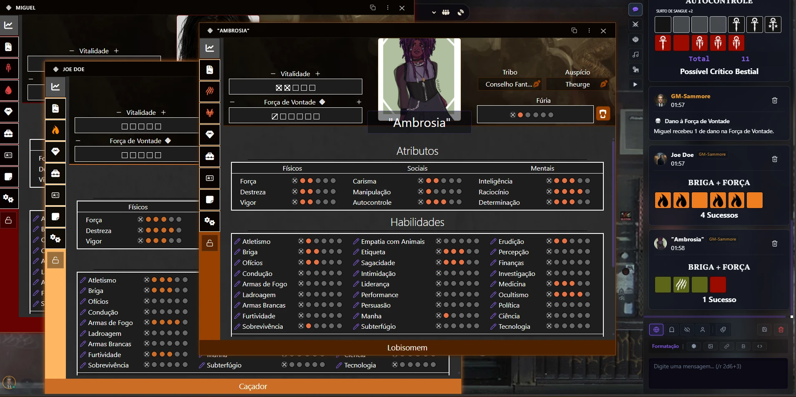

# World of Darkness 5e System

[![GNU GPL v3 License]][License URL]

This is the LoomVTT adaptation of the community-created World of Darkness 5e system. It is maintained in a new repository and is not a GitHub fork of the upstream repository. The adaptation is based on [WoD5E by Rayji96 and its upstream contributors](https://github.com/WoD5E-Developers/wod5e).

For changes to this Loom adaptation, see this repository's [releases](https://github.com/sammore2/wod5e-loom/releases). For the original system's documentation, see the [upstream WoD5E documentation](https://wod5e-developers.github.io/).

Current supported systems include:
* Vampire the Masquerade, 5th Edition
* Hunter the Reckoning, 5th Edition
* Werewolf the Apocalypse, 5th Edition

## Dice

To roll the splat-unique dice, replace the usual roll formula like so:
* To roll Vampire dice, roll `1dv`. To roll Hunger dice, roll `1dg`.
* To roll Hunter dice, roll `1dh`. To roll Desperation dice, roll `1ds`.
* To roll Werewolf dice, roll `1dw`. To roll Rage dice, roll `1dr`.

Replace the 1s with however many you want to roll for each type, and let the dice roll!

## Feedback

Bugs or feature requests for the Loom adaptation can be reported on [this repository's issue tracker](https://github.com/sammore2/wod5e-loom/issues).

For questions about the upstream project, use its community channels. Questions about this Loom adaptation belong in this repository's issue tracker.

Please check the issues list before suggesting new features.

## Contributors & Contributing

**Loom adaptation and port:** [sammore2](https://github.com/sammore2/wod5e-loom).

**Original WoD5E system:** created by [Rayji96](https://github.com/Rayji96) and led upstream by [Veilza](https://github.com/Veilza). The upstream project's [full contributor list](https://github.com/WoD5E-Developers/.github/blob/main/contributors.md) is also credited.

This repository contains modifications for LoomVTT. Work on the Loom adaptation began in August 2026. It is a separate repository, not an official WoD5E release or a GitHub fork; the original project and its authors remain credited above.

If you'd like to contribute to the Loom adaptation, open an issue or pull request in this repository.

If you'd like to help contribute localization updates, you can either open up an issue with the "Localization" issue type, or you can do a pull request with updates as needed.

## Dark Pack and independence notice

[![Dark Pack]][Dark Pack URL]

This free community ruleset does not include complete paid rulebooks. It is unofficial and is not official World of Darkness material.

Portions of the materials are the copyrights and trademarks of Paradox Interactive AB, and are used with permission. All rights reserved. For more information please visit worldofdarkness.com.

Use of World of Darkness IP in this material follows the [Dark Pack Agreement], including its non-commercial conditions. The commercial Loom engine is separate from this free ruleset.

# System License

World of Darkness 5e System, Copyright (C) 2024, World of Darkness 5e Developers

This modified version is released under the GNU General Public License, version 3 or (at your option) any later version. See [LICENSE.md](LICENSE.md). The upstream code's license and attribution notices are retained.

This program is free software: you can redistribute it and/or modify
it under the terms of the GNU General Public License as published by
the Free Software Foundation, either version 3 of the License, or
(at your option) any later version.

This program is distributed in the hope that it will be useful,
but WITHOUT ANY WARRANTY; without even the implied warranty of
MERCHANTABILITY or FITNESS FOR A PARTICULAR PURPOSE.  See the
GNU General Public License for more details.

You should have received a copy of the GNU General Public License
along with this program.  If not, see <https://www.gnu.org/licenses/>.

[GNU GPL v3 License]: https://img.shields.io/badge/License-GNU_GPL_v3-green
[License URL]: ./LICENSE.md

[Dark Pack]: ./assets/github/darkpack_logo2.png
[Dark Pack URL]: https://www.paradoxinteractive.com/games/world-of-darkness/community/dark-pack-agreement
[Dark Pack Agreement]: https://www.paradoxinteractive.com/games/world-of-darkness/community/dark-pack-agreement

